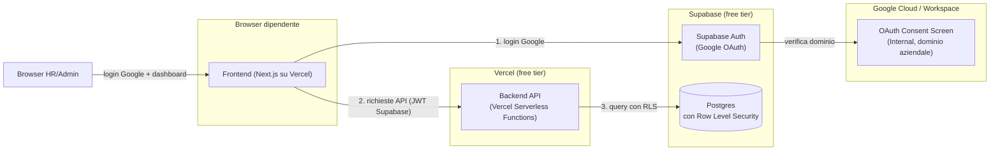
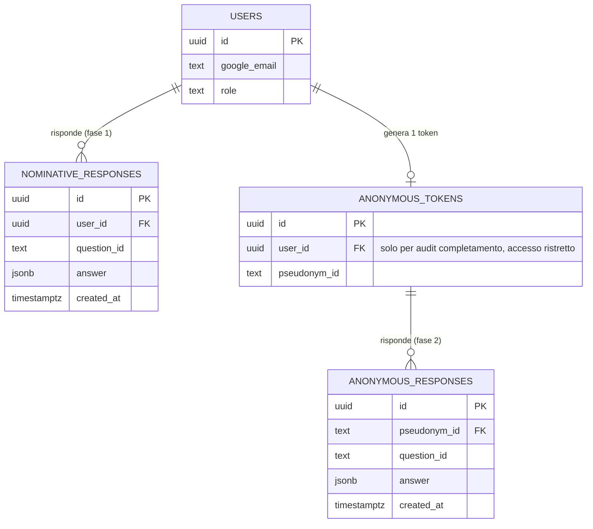

# Proposta di Architettura — Open Listening · Active Care (Fase Pilota)

> **Stato:** proposta per discussione, non ancora validata da DPO/IT del cliente.
> **Ambito:** architettura tecnica per portare il prototipo HTML
> (`Open_Listening_Active_Care_Prototype.html`) da mockup cliccabile ad
> applicazione reale per un **pilota** con circa 100 dipendenti.

## 1. Executive summary

Si propone un'architettura a 3 livelli (frontend / backend / database) ospitata
sui tier gratuiti di **Vercel** (frontend + backend) e **Supabase**
(database Postgres + autenticazione), con login Google aziendale obbligatorio
sia per i dipendenti che compilano il survey sia per l'accesso HR alla
dashboard dei risultati.

Il punto chiave dell'architettura è la **separazione tecnica** — non solo
applicativa — tra i dati della fase nominativa ("My Energy Battery") e quelli
della fase anonima ("Fattori Energy Battery"), realizzata a livello di
database tramite Row Level Security di Postgres, in coerenza con i vincoli
GDPR già individuati per questo progetto.

Questa proposta è pensata per la scala del pilota (≤ 100 persone) e per un
budget iniziale nullo. Non sostituisce una valutazione formale del DPO, che
resta necessaria prima di qualunque raccolta dati reale.

## 2. Obiettivi e vincoli

- Pubblicare l'app per un pilota reale, senza budget di hosting dedicato.
- Aggiungere un backend e un database persistente (il prototipo attuale non
  salva nulla, gira solo lato client).
- Proteggere sia il frontend (login dipendenti) sia il backend/dashboard
  (accesso HR) con **autenticazione Google account aziendale**.
- Rispettare i vincoli già emersi nel progetto (vedi `CLAUDE.md`, sezione 7):
  dati nominativi + benessere = dati sensibili; i manager non devono accedere
  ai dati individuali; soglia minima di anonimato di 5 risposte per segmento
  aggregato; necessità di validazione DPO prima del deploy reale.
- Restare ragionevolmente portabile verso uno stack definitivo diverso, non
  ancora deciso, per la fase successiva al pilota.

## 3. Panoramica architetturale

**Nota sul "backend":** con Next.js su Vercel, frontend e backend condividono
lo stesso repository/deploy (API routes = funzioni serverless), ma restano
due livelli logici distinti: il frontend non parla mai direttamente al
database, passa sempre dalle API, dove vive la logica di business (validazione,
soglie di aggregazione, pseudonimizzazione).

## 4. Componenti

### Frontend
- **Next.js**, deployato su **Vercel** (tier free).
- Riprende UI/UX già validate nel prototipo (mascotte SVG, flow domande a
  capitoli, temi caldo/freddo) — porting del markup/CSS/JS esistente in
  componenti React, senza cambiare l'esperienza utente già approvata.
- Due aree: **survey** (dipendenti, dietro login Google) e **dashboard HR**
  (dietro login Google con ruolo admin).

### Backend
- **API routes** Next.js (funzioni serverless su Vercel).
- Responsabilità: verificare il token di sessione, applicare le regole di
  business (es. blocco avanzamento se domande obbligatorie mancanti — già
  presente lato client nel prototipo, va **rivalidato anche lato server**),
  scrivere le risposte nel database, esporre endpoint di aggregazione per la
  dashboard HR (con soglia minima 5 risposte applicata server-side, mai
  bypassabile dal frontend).

### Database
- **Postgres su Supabase** (tier free: 500 MB storage, adeguato per un
  pilota di questa scala).
- Row Level Security (RLS) attiva su tutte le tabelle sensibili: è il layer
  che garantisce *tecnicamente* — non solo per convenzione applicativa — chi
  può leggere cosa (vedi sezione 6).

### Autenticazione
- **Supabase Auth** con provider **Google OAuth**.
- Due ruoli: `employee` (compila il survey) e `hr_admin` (accede alla
  dashboard aggregata). Il ruolo è assegnato tramite una tabella `profiles`
  collegata all'utente Supabase, non deducibile dal solo login Google.

## 5. Autenticazione Google aziendale

Due flussi distinti, entrambi passano da Google OAuth ma con scopi diversi:

1. **Login dipendente**: il dipendente apre il link del survey, fa login con
   il proprio account Google aziendale, e questo identifica la sua sessione
   per la fase nominativa. Sostituisce il campo Nome/Cognome inserito
   manualmente nel modal "Prima di iniziare" del prototipo attuale.
2. **Login HR/Admin**: l'HR accede alla dashboard con lo stesso meccanismo di
   login Google, ma con un ruolo `hr_admin` che dà accesso solo a viste
   aggregate (mai a risposte individuali — vedi sezione 6).

**Restrizione al dominio aziendale.** Il modo più robusto per garantire che
*solo* account del dominio aziendale possano autenticarsi è configurare il
progetto OAuth su Google Cloud Console come **tipo "Interno" (Internal)**,
opzione disponibile solo se il progetto è associato al Google Workspace
dell'azienda cliente: in questo caso Google stesso impedisce il login ad
account esterni al dominio, prima ancora che la richiesta arrivi alla nostra
app. Questo richiede che l'app OAuth sia creata **dentro** l'organizzazione
Google Workspace del cliente (non nel nostro account personale), quindi:

> **Prerequisito bloccante**: serve coinvolgere l'IT del cliente per creare
> (o darci accesso a) un progetto Google Cloud legato al loro Workspace, con
> consent screen di tipo Internal. È stato segnalato come "da verificare
> successivamente" — va tracciato come dipendenza prima di iniziare
> l'implementazione dell'autenticazione.

In assenza di questo accesso, come fallback temporaneo si può restringere il
dominio a livello applicativo (verifica del claim `hd` — hosted domain — nel
token Google, rifiutando lato backend i login con dominio diverso), ma è una
protezione più debole (aggirabile con più difficoltà ma non impossibile senza
il controllo Google-side) e va usata solo come misura ponte.

## 6. Modello dati e privacy by design

Punto centrale della proposta: la separazione tra dati nominativi (fase 1) e
dati anonimi (fase 2) non è solo una scelta di UX ("da qui in poi sei
anonimo") ma un **vincolo tecnico** imposto dal database stesso.

- Al passaggio dalla fase 1 alla fase 2 (schermata "Da qui in poi..." del
  prototipo), il backend genera uno **pseudonym_id** non riconducibile
  direttamente all'utente nelle query ordinarie.
- Le risposte della fase 2 (`anonymous_responses`) sono scritte usando solo
  lo pseudonym_id: nessuna riga di questa tabella contiene l'identità Google.
- La tabella `anonymous_tokens`, che collega `user_id` a `pseudonym_id`,
  serve **solo** per scopi di audit (es. verificare che ogni dipendente
  abbia completato il survey una sola volta) ed è protetta da una RLS che la
  rende illeggibile a chiunque tranne un ruolo tecnico di sistema — **non**
  accessibile né da `hr_admin` né da query applicative della dashboard.
- Le viste esposte alla dashboard HR sono **solo aggregate** (es. media per
  reparto, conteggio per fascia di risposta) e la query stessa nega il
  risultato se il gruppo ha meno di 5 risposte (soglia già definita nel
  progetto), applicata sia in SQL (view con `HAVING count(*) >= 5`) sia
  ribadita nel layer API.

Questo disegno risponde direttamente ai punti aperti in `CLAUDE.md` §7
(separazione tecnica nominativo/anonimo, soglia minima 5, manager senza
accesso ai dati individuali), ma **resta una proposta tecnica da sottoporre
al DPO**, non una garanzia di conformità GDPR in sé.

## 7. Hosting e limiti dei tier free (per un pilota ≤ 100 persone)

| Servizio | Tier free | Limiti rilevanti | Adeguatezza per il pilota |
|---|---|---|---|
| Vercel | Hobby | 100 GB banda/mese, funzioni serverless con timeout 10s | Ampiamente sufficiente per ~100 utenti |
| Supabase | Free | 500 MB DB, 50.000 utenti auth/mese, **progetto messo in pausa dopo 7 giorni di inattività** | Sufficiente per storage; la pausa va gestita (vedi sotto) |

**Mitigazione pausa Supabase:** durante la finestra del pilota, va previsto
un meccanismo semplice di keep-alive (es. una richiesta pianificata ogni
pochi giorni verso il database) per evitare che il progetto vada in pausa
tra un'ondata di risposte e l'altra. È una configurazione minima, da
documentare come task operativo, non un problema architetturale.

Se il pilota avesse successo e si passasse a una popolazione più ampia, il
passaggio ai tier a pagamento di Vercel e Supabase è diretto (stesso stack,
nessuna riscrittura), oppure si valuta la migrazione descritta in sezione 9.

## 8. Sicurezza e conformità — cosa resta da fare

Questa proposta **non sostituisce** una valutazione del Data Protection
Officer. Prima di raccogliere dati reali da dipendenti, restano aperti:

- Validazione formale DPO del trattamento dati (fase nominativa = dati
  sensibili legati al benessere).
- Informativa privacy da presentare ai dipendenti prima del login/survey.
- Policy di retention: per quanto tempo si conservano le risposte nominative
  e chi può richiederne la cancellazione.
- Verifica che l'uso di Supabase (infrastruttura extra-UE per il tier free,
  da confermare la region) sia compatibile con i requisiti di trattamento
  dati del cliente — Supabase permette di scegliere la region del progetto
  (es. `eu-central-1`), da impostare esplicitamente in fase di creazione.

## 9. Percorso di migrazione futuro

Lo stack proposto è pensato per il pilota, non come scelta definitiva
(coerente con `CLAUDE.md` §7, che lascia aperto lo stack per lo sviluppo
definitivo). Per limitare il lock-in:

- Il modello dati è Postgres standard: portabile verso qualunque hosting
  Postgres gestito (RDS, Cloud SQL, altro provider Supabase-compatibile)
  senza riscrivere lo schema.
- Le RLS policy sono SQL Postgres nativo, non un costrutto proprietario di
  Supabase: si spostano insieme al database.
- La logica di business vive nelle API routes (codice Node/TypeScript
  ordinario), non in funzioni serverless proprietarie non portabili: si può
  spostare su un server Node tradizionale se necessario.
- Il punto di maggior lock-in è **Supabase Auth**: se si cambia provider di
  identità in futuro, va previsto uno sforzo di migrazione utenti (export
  email + remapping ruoli), da mettere in conto se si cambia stack.

## 10. Rischi e punti aperti

- **Bloccante**: accesso admin al Google Workspace/Cloud Console del cliente
  per configurare l'OAuth consent screen di tipo Internal (sezione 5) — da
  verificare con l'IT aziendale prima di iniziare l'implementazione
  dell'autenticazione.
- Validazione DPO non ancora effettuata (sezione 8).
- Le liste BU/CDC e fasce di anzianità (domande `bu`/`anzianita` in
  `step2`) restano da confermare col cliente, indipendentemente
  dall'architettura (già annotato in `CLAUDE.md`).
- Se il pilota cresce oltre ~100 persone durante la sua durata, va
  monitorato l'utilizzo dei tier free (soprattutto storage Supabase) per
  anticipare un eventuale upgrade a pagamento.

## 11. Prossimi passi proposti

1. Validare questa proposta con il cliente (architettura + hosting scelto).
2. Aprire il ticket con l'IT del cliente per l'accesso Google Workspace/Cloud
   Console (dipendenza bloccante per l'auth).
3. Avviare in parallelo la validazione DPO sul trattamento dati.
4. Solo dopo 1–3: iniziare l'implementazione (porting del prototipo a
   Next.js, schema database, integrazione auth).
